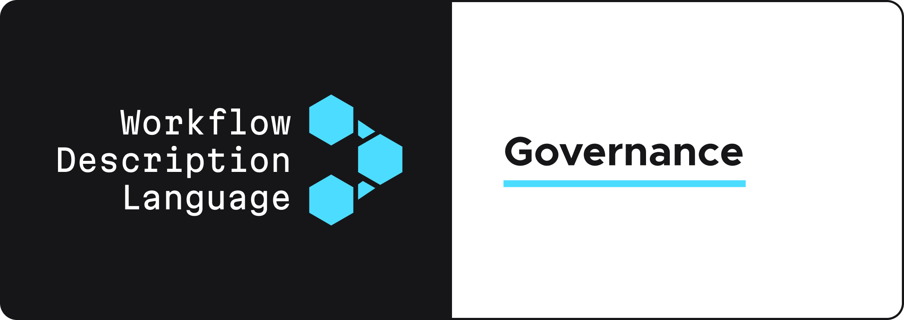

  

 

The OpenWDL project is governed by a community-driven development process wherein all sufficiently impactful decisions are made via consensus under the stewardship of the **governance committee**.
The intention is that most most decisions will be made via community discussion and agreement and, in the rare cases that community consensus is not reached, the governance committee will vote to decide the issue.

Major issues, such as the introduction of new features to WDL, setting the project's priorities, and setting the release schedule of the language, should be introduced via an [RFC](./RFC.md).
Smaller issues, such as clarifications to the existing specification that keep the spirit of previously agreed upon technical decisions, grammatical errors, and other housekeeping tasks, are not required to go through this process.

# Governance committee

The current members of the governance committee are:

| Name                  | Organization                          | github                                              |
| :-------------------- | :------------------------------------ | :-------------------------------------------------- |
| John Didion           | Fulcrum Genomics                      | [jdidion](https://github.com/jdidion)               |
| Taylor Firman         | Fred Hutch                            | [tefirman](https://github.com/tefirman)             |
| Jeff Gentry           | Fulcrum Genomics                      | [geoffjentry](https://github.com/geoffjentry)       |
| Peter Huene           | St. Jude Children's Research Hospital | [peterhuene](https://github.com/peterhuene)         |
| Mike Lin              | Chan Zuckerberg Initiative            | [mlin](https://github.com/mlin)                     |
| Christopher Llanwarne | Broad Institute                       | [cjllanwarne](https://github.com/cjllanwarne)       |
| Patrick Magee         | DNAstack                              | [patmagee](https://github.com/patmagee)             |
| Venkat Malladi        | Microsoft                             | [vsmalladi](https://github.com/vsmalladi)           |
| Clay McLeod           | St. Jude Children's Research Hospital | [claymcleod](https://github.com/claymcleod)         |
| Brian O'Connor        | Sage Bionetworks                      | [briandoconnor](https://github.com/briandoconnor)   |
| Mark Schreiber        | Amazon                                | [markjschreiber](https://github.com/markjschreiber) |
| Ruben Vorderman       | Leiden University Medical Center      | [rhpvorderman](https://github.com/rhpvorderman)     |

## Adding a new member

At the core group's discretion a new member may be added by a majority vote. This addition will be done to recognize **significant** contributions to the community. *Contributions* include such things as:

 - Active participation in discussions, mailing list, forums
 - Community building efforts
 - Helping with documentation, standards documents, etc
 - Building supporting software and tooling

Generally members are only removed at their own request are due to very long term inactivity. In extreme circumstances the core group can vote to remove a member.

# The RFC process

Any changes submitted to the WDL specification, project priorities, or the release schedule are subject to the [RFC](RFC.md) process. Please review and familiarize yourself with the process if you would like to see changes submitted to the specification.

# Contributing to the OpenWDL project

All contributors to the OpenWDL project must read and abide by the principles laid out in the [`CONTRIBUTING.md`](./CONTRIBUTING.md) document. This applies to _all_ codebases under the OpenWDL organization—not just the specification.
